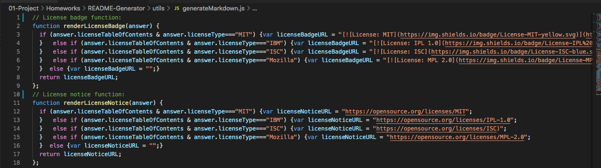
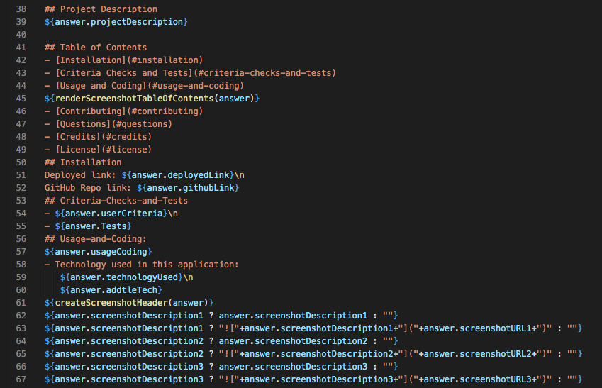
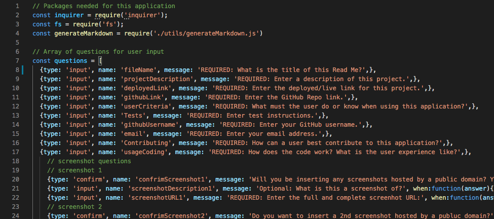
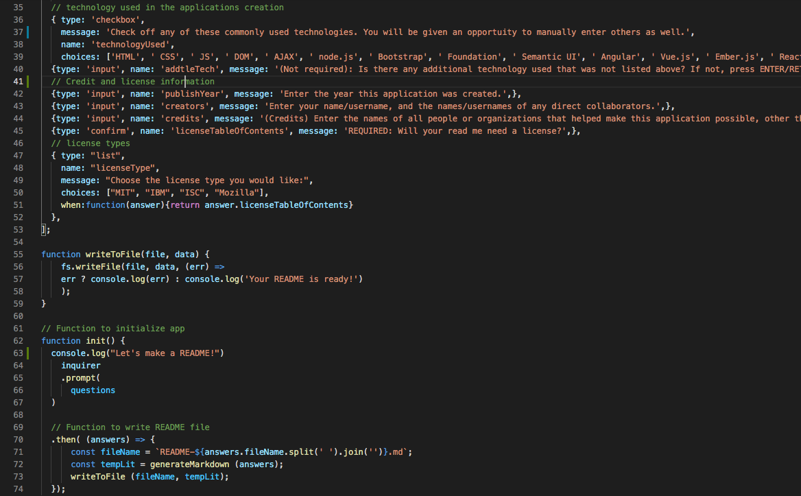

# README-Generator
 
## Project Description
This application was created so a user could easily create a README file by responding to a series of prompts created through Inquirer. 
 
## Table of Contents
- [Installation](#installation)
- [Criteria Checks](#criteria)
- [Usage and Coding](#Usage/coding)
- [Screenshots](#screenshots)
- [Questions](#questions)
- [Credits](#credits)
- [License](#license)
## Installation
Clone or download this repository on GitHub: https://github.com/edoliva/README-Generator  
## Criteria
- The user must must run "npm install", then enter "node index.js" in terminal to begin the README Generator application.
- The user will need to have their GitHub repo link, the deployed link to their application, their GitHub username, and an email address.
## Usage/coding:
- This JS application was written to allow for a clean user experience. The general logic is as follows:
   - Once the initial criteria above is met, the user will respond to a series of prompts.
   - The prompts will populate a Template Literal in the form of a user friendly README.
   - Blank responses will not effect the functionality. 
   - User respones will be used in various ways; some stand alone, while others concatenate to predefined text in the Template Literal.  

- Licensing:
   - The user is given a "confirm" prompt to see if they want to use a license, if their response is "n", then no further license prompts will be displayed.
   - If they answer "y" then they can choose from 4 pre-defined license types. 
   - This choice will drive the results of an IF STATEMENT inside a function, displaying the license badge atop the READNE, as well as a link the the license details at the bottom of the README. 

- Screenshot information:
   - If the user would like to enter screenshots, by indicating a "y" response to that prompt, then:
      1) Through a function, the Screenshot section of the table of contents will be created. If a "n" response is given then there will be no Screenshot section in the table of contents. 
      2) A Screenshot header will be created in the body of the README through another function. 
      3) Regardless of the user choice, there will never be an "undefined" output in the README.
   - Using Ternary Operators, the screenshot descritpions and url will be populated in the body of the README.
   - Ternary Operators were used to avoid the "undefined" result of a blank user entry. 
   - The user can enter up to 4 screenshots. They will only be asked if they want to submit a screenshot if their previous response was "y". Once they answer "n" the screenshot prompts will terminate. 
 
## Screenshots

LicenseFunctions:
-

-
Table of Contents(with function) and Ternary Operators:  
-

-
Inquirer and Prompts:
-

-
Write and Init Functions:
-

-

## Questions
Please direct any questions regarding this application to:
- GitHub username: edoliva
- GitHub profile link: https://github.com/edoliva
- Email address: edmond.oliva@gmail.com 

## Credits
Shoutout to our instructor Anthony and TA Tom! As well as everyone at Trilogy Education for making the content and grading our assignments.
 
## License
© 2021 Ed Oliva

Confidential and Proprietary. All Rights Reserved.

Permission is hereby granted, free of charge, to any person obtaining a copy of this software and associated documentation files (the "Software"), to deal in the Software without restriction, including without limitation the rights to use, copy, modify, merge, publish, distribute, sublicense, and/or sell copies of the Software, and to permit persons to whom the Software is furnished to do so, subject to the following conditions:

The above copyright notice and this permission notice shall be included in all copies or substantial portions of the Software.

THE SOFTWARE IS PROVIDED "AS IS", WITHOUT WARRANTY OF ANY KIND, EXPRESS OR IMPLIED, INCLUDING BUT NOT LIMITED TO THE WARRANTIES OF MERCHANTABILITY, FITNESS FOR A PARTICULAR PURPOSE AND NONINFRINGEMENT. IN NO EVENT SHALL THE AUTHORS OR COPYRIGHT HOLDERS BE LIABLE FOR ANY CLAIM, DAMAGES OR OTHER LIABILITY, WHETHER IN AN ACTION OF CONTRACT, TORT OR OTHERWISE, ARISING FROM, OUT OF OR IN CONNECTION WITH THE SOFTWARE OR THE USE OR OTHER DEALINGS IN THE SOFTWARE.
---
